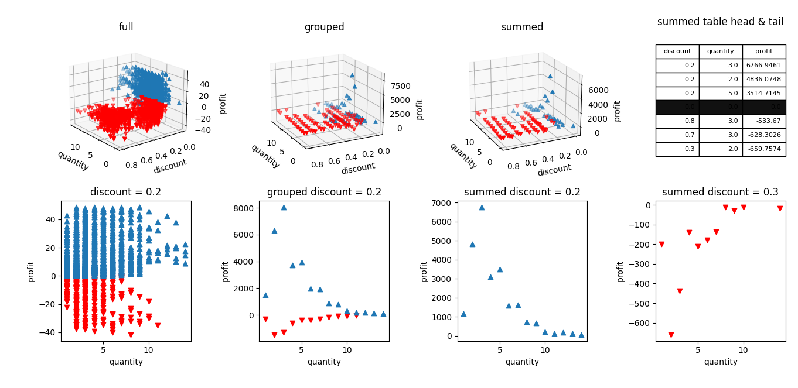

# tokopaedi



Saat ini dibuat, saya sedang mengikuti sebuah bootcamp data analyst. Kemudian di salah satu kelas tentang mysql, selain diberikan file untuk di-restore ke DB PostgreSQL, juga diberikan file berbentuk csv. Dan dari file csv ini lah saya mencoba untuk menganalisisnya. Meskipun sebenarnya untuk materinya belum sampai ke python sih hehe..

Dari data yang diberikan itu terlihat masih ada transaksi yang pada kolom 'profit' bernilai minus(-). Yang mana ini menandakan bahwa pada transaksi itu merugi. Dari situlah saya mencoba menganilisisnya dengan maksud untuk mengetahui apa yang menyebabkan suatu transaksi menjadi merugi.

## Analisis Awal
Untuk analisis awal ini saya menggunakan data yang telah di-restore ke dalam DB PostgreSQL. Saya mencoba mengambil data yang profitnya bernilai minus(-).
```sql
select 
    * 
from tokopaedi 
where 
    profit < 0 
```
Dari hasilnya terlihat bahwa banyak yang pada kolom 'discount' tidak bernilai '0' atau bisa diindikasikan bahwa diskon menjadi salah satu penyebab terjadinya kerugian.
Kemudian untuk lebih memastikan, saya coba mengambil data transaksi merugi dengan diskon = 0
```sql
select 
    * 
from tokopaedi 
where 
    profit < 0 
    and discount = 0 
```
Saat dijalankan, tidak menampilkan data sama sekali. Yang memastikan bahwa semua transaksi merugi ialah transaksi yang menggunakan diskon

Dari analisis awal ini, saya melanjutkan analisis saya menggunakan python

## Proses
1. Persiapan & pembersihan data
    - mengimpor data file csv
    - menghapus data dengan discount == 0 (karena hanya data transaksi dengan diskon saja yang akan dianalisis)
    - menghapus pencilan/outlier
2. Analisis data
    - memisahkan data transaksi yang untung dengan yang rugi menjadi variabel yang berbeda
    - 
3. Visualisasi data

## Kolom yang Digunakan
1. quantity
2. discount
3. profit

## Analisis Data
1. Memisahkan data transaksi yang untung dengan yang rugi menjadi variabel yang berbeda

    Hal ini saya lakukan untuk mengetahui seberapa banyak transaksi yang untung & rugi. Dari sini terlihat bahwa transaksi untung pada saat diskon rendah,sedangkan pada transaksi dengan diskon tinggi terlihat lebih banyak yang merugi.

    Saat saya perhatikan kembali, transaksi yang merugi terlihat paling padat pada diskon = 0.2.

2. Mengambil data transaksi dengan diskon = 0.2

    Setelah sebelumnya mengetahui bahwa transaki merugi paling padat pada data diskon = 0.2, saya memutuskan untuk mengambil data quantity dan profit dengan diskon = 0.2. Di sini saya bermaksud untuk mengetahui pada quantity berapa yang paling merugikan.

    Namun, di sini masih belum terlihat jelas pada pada quantity berapa yang paling merugikan.

3. Grouping kolom 'discount' & 'quantity'

    Grouping ini saya lakukan secara terpisah antara variabel untung dan rugi.

    Saya melakukan grouping ini bertujuan untuk mengetahui kombinasi 'discount' & 'quantity' mana yang paling merugikan

    Saat saya perhatikan, seperti pada seblumnya, yang paling banyak menunjukkan kerugian ada pada diskon = 0.2.

4. Mengambil data grouping dengan diskon = 0.2
    
    Setelah mengetahui bahwa transaksi yang paling merugi adalah pada diskon = 0.2, maka saya coba untuk mengetahui pada quantity berapakah yang paling merugi.

    Setelah saya melihat hasilnya, saya masih ragu untuk menentukan pada quantity berapa yang dapat dianggap paling merugi, karena di quantity dengan nilai kerugian yang besar, di quantity itu pula terlihat keuntungan yang besar juga. Sehingga saya masih ragu apakah kombinasi diskon dan quantity itu masuk menjadi kombinasi yang merugikan.

5. Menambahkan nilai transaksi untung dan rugi

    Sebenarnya ini juga menggunakan metode grouping. Namun, yang membedakan ialah yang saya grouping langsung dari data bersih tanpa memisahkan transaksi untung dan rugi. Barulah setelah didapatkan hasilnya dipisahkan antara yang rugi dan untung.

    Untuk hasilnya ternyata berbeda sebelumnya. Dimana sebelumnya terlihat bahwa yang paling merugi ada pada diskon = 0.3. Sedangkan pada diskon = 0.2 malah memperlihatkan keuntungan yang besar.

6. Mengambil data yang telah ditambahkan dengan diskon = 0.2 & diskon = 0.3

    Di sini saya ingin mengetahui pada quantity berapa kah diskon = 0.2 yang paling menguntungkan dan pada diskon = 0.3 yang paling merugikan.

    Dari hasil yang diperlihatkan, diketahui bahwa pada diskon = 0.2 dengan quantity = 3 yang paling menguntungkan. Sedangkan untuk diskon = 0.3 dengan quantity = 2 yang paling merugikan

## Kesimpulan & Saran
Dari hasil analisis yang telah saya lakukan, dapat terlihat bahwa kombinasi yang paling menguntungkan ada pada diskon = 0.2 dengan quantity = 3. Sedangkan untuk kombinasi yang paling merugikan ada pada diskon = 0.3 dengan quantity = 2.

Jadi saran saya untuk kedepannya jika ingin memberikan diskon, maka saran saya untuk memberikan diskon sebesar 0.2(20%) dengan batas quantity sebanyak 3 unit.

## Eksplorasi lebih jauh
Menurut saya data ini dapat di-explore lebih lanjut seperti untuk menegetahui kombinasi produk, diskon dan quantity mana yang paling menguntungkan atau paling merugikan. Ini dapat dilihat dengan menggunakan query sql berikut :
```sql
select 
	product_name ,
	quantity ,
	discount ,
	sum(profit) tot_profit ,
	count(profit) jml_transaksi,
	count(distinct order_id) jml_order
from tokopaedi t 
where 
	discount != 0 -- hanya ambil transaksi dengan diskon
	and profit between -39.724125 and 70.816875 -- jangan ambil outlier
group by quantity, discount, product_name  
order by sum(profit) desc
```
Untuk mendapatkan mana yang paling merugikan dapat dengan mengganti arah ordernya menjadi "asc" 

# Sekian